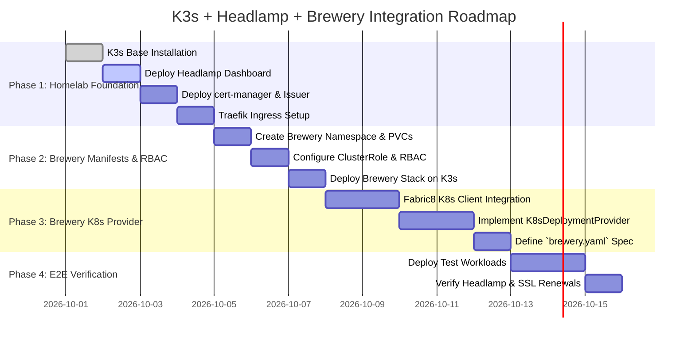

# Homelab Deployment Redesign: K3s + Headlamp + Brewery Integration

> **Document Status:** Active Specification  
> **Target Platform:** Ubuntu Server (Linux)  
> **Orchestration Layer:** K3s (Lightweight Kubernetes)  
> **Management Dashboard:** Headlamp  
> **SSL/TLS & Ingress:** Traefik + cert-manager (Let's Encrypt)  
> **Edge Networking:** Edge VPS TCP Passthrough via WireGuard  
> **Build & Registry Orchestrator:** Brewery Platform  

---

## 1. Executive Summary & Architectural Vision

This specification outlines the redesign of the homelab deployment engine. To ensure long-term reliability and zero-maintenance infrastructure overhead, we decouple the system into two distinct layers:

1. **Independent Homelab Infrastructure (K3s + Headlamp + Traefik + cert-manager):**  
   Acts as the base operating runtime for host resources, container lifecycles, health monitoring, secret storage, HTTPS SSL/TLS certificate automation, and ingress routing. The Edge VPS operates purely as a **raw TCP passthrough** over WireGuard; all SSL termination and certificate renewals happen inside K3s.
2. **Brewery Application Extension:**  
   Acts as an intelligent client layer running inside the cluster (`namespace: brewery`). It manages source webhooks, dependency graphs, multi-stage builds (C++, Rust, Go, TypeScript, Python), the versioned artifact registry, and hands off deployment triggers to K3s via standard Kubernetes APIs.

---

## 2. Decoupled System Architecture

```
                                  [ DEVELOPER / GITHUB PUSH ]
                                               │
                                               ▼
┌─────────────────────────────────────────────────────────────────────────────────────────────┐
│                             HOMELAB HOST (UBUNTU SERVER LTS)                                │
│                                                                                             │
│  ┌───────────────────────────────────────────────────────────────────────────────────────┐  │
│  │ K3S CLUSTER (k3s.service)                                                             │  │
│  │                                                                                       │  │
│  │  ┌───────────────────────────────┐     ┌───────────────────────────────────────────┐  │  │
│  │  │ Headlamp Dashboard            │     │ Traefik Ingress + cert-manager            │  │  │
│  │  │ (namespace: headlamp)         │     │ (SSL Termination & Auto Let's Encrypt)    │  │  │
│  │  └───────────────────────────────┘     └─────────────────────▲─────────────────────┘  │  │
│  │                                                              │ Encrypted WireGuard    │  │
│  │                                                              │ TCP Ports 80 / 443     │  │
│  │                                        ┌─────────────────────┴─────────────────────┐  │  │
│  │                                        │ Edge VPS (Raw TCP Passthrough / WireGuard)│  │  │
│  │                                        └─────────────────────▲─────────────────────┘  │  │
│  │                                                              │ Public HTTPS Requests  │  │
│  │                                                              │                        │  │
│  │  ┌───────────────────────────────────────────────────────────┴─────────────────────┐  │  │
│  │  │ BREWERY PLATFORM (namespace: brewery)                                           │  │  │
│  │  │ ┌──────────────────┐   ┌───────────────────┐   ┌──────────────────────────────┐ │  │  │
│  │  │ │ Build Engine     │──►│ Artifact Registry │──►│ K8s Deployment Adapter       │ │  │  │
│  │  │ │ (Docker / Bin)   │   │ (Internal Images) │   │ (Fabric8 K8s Client)         │ │  │  │
│  │  │ └──────────────────┘   └───────────────────┘   └──────────────┬───────────────┘ │  │  │
│  │  └───────────────────────────────────────────────────────────────┼─────────────────┘  │  │
│  │                                                                  │                    │  │
│  │                                                                  │ K8s REST API Patch │  │
│  │                                                                  ▼                    │  │
│  │  ┌─────────────────────────────────────────────────────────────────────────────────┐  │  │
│  │  │ HOMELAB WORKLOADS (namespaces: default, prod, dev)                              │  │  │
│  │  │ ┌──────────────────┐   ┌───────────────────┐   ┌──────────────────────────────┐ │  │  │
│  │  │ │ C++ / Rust Services│  │ Go Microservices  │   │ Node.js / Python Web Apps    │ │  │  │
│  │  │ └──────────────────┘   └───────────────────┘   └──────────────────────────────┘ │  │  │
│  │  └─────────────────────────────────────────────────────────────────────────────────┘  │  │
│  └───────────────────────────────────────────────────────────────────────────────────────┘  │
└─────────────────────────────────────────────────────────────────────────────────────────────┘
```

---

## 3. Implementation Roadmap



---

## 4. Detailed Execution Phases

### Phase 1: Homelab Foundation (K3s + Headlamp + cert-manager + Ingress)

#### Goal
Establish an independent Kubernetes runtime, visual monitoring dashboard, and automated SSL/TLS certificate issuer on Ubuntu Server.

#### Step 1.1: K3s Installation
Install K3s with ServiceLB disabled (allowing Traefik to bind directly to host ports 80/443 for WireGuard TCP passthrough):
```bash
curl -sfL https://get.k3s.io | sh -s - --disable=servicelb
```
Verify cluster nodes:
```bash
kubectl get nodes -o wide
```

#### Step 1.2: Headlamp Dashboard Deployment
Deploy Headlamp into namespace `headlamp`:
```bash
kubectl create namespace headlamp
kubectl apply -f https://raw.githubusercontent.com/headlamp-k8s/headlamp/main/kubernetes-headlamp.yaml -n headlamp
```

Create an admin ServiceAccount token for Headlamp browser authentication:
```yaml
apiVersion: v1
kind: ServiceAccount
metadata:
  name: headlamp-admin
  namespace: headlamp
---
apiVersion: rbac.authorization.k8s.io/v1
kind: ClusterRoleBinding
metadata:
  name: headlamp-admin-binding
subjects:
  - kind: ServiceAccount
    name: headlamp-admin
    namespace: headlamp
roleRef:
  kind: ClusterRole
  name: cluster-admin
  apiGroup: rbac.authorization.k8s.io
```
Generate login bearer token:
```bash
kubectl create token headlamp-admin -n headlamp --duration=8760h
```

#### Step 1.3: Automated SSL/TLS Engine Setup (`cert-manager`)
Deploy `cert-manager` for automatic Let's Encrypt SSL issuance and 90-day auto-renewals:
```bash
kubectl apply -f https://github.com/cert-manager/cert-manager/releases/download/v1.14.4/cert-manager.yaml
```

Create the Let's Encrypt `ClusterIssuer`:
```yaml
apiVersion: cert-manager.io/v1
kind: ClusterIssuer
metadata:
  name: letsencrypt-prod
spec:
  acme:
    server: https://acme-v02.api.letsencrypt.org/directory
    email: admin@homelab.local
    privateKeySecretRef:
      name: letsencrypt-prod-account-key
    solvers:
      - http01:
          ingress:
            class: traefik
```

#### Step 1.4: Ingress Configuration for Headlamp
Create a Traefik Ingress route for Headlamp with automatic TLS termination:
```yaml
apiVersion: networking.k8s.io/v1
kind: Ingress
metadata:
  name: headlamp-ingress
  namespace: headlamp
  annotations:
    cert-manager.io/cluster-issuer: letsencrypt-prod
spec:
  tls:
    - hosts:
        - headlamp.homelab.local
      secretName: headlamp-tls-cert
  rules:
    - host: headlamp.homelab.local
      http:
        paths:
          - path: /
            pathType: Prefix
            backend:
              service:
                name: headlamp
                port:
                  number: 80
```

---

### Phase 2: Brewery Cluster Deployment & RBAC Permissions

#### Goal
Migrate Brewery into the cluster under `namespace: brewery` and grant it permissions to manage Kubernetes Deployments.

#### Step 2.1: Namespace & Storage
```yaml
apiVersion: v1
kind: Namespace
metadata:
  name: brewery
---
apiVersion: v1
kind: PersistentVolumeClaim
metadata:
  name: brewery-artifact-store-pvc
  namespace: brewery
spec:
  accessModes:
    - ReadWriteOnce
  resources:
    requests:
      storage: 50Gi
```

#### Step 2.2: Brewery RBAC Permissions
Grant Brewery's pod ServiceAccount permissions to inspect and patch Deployments, Services, ConfigMaps, and Secrets across namespaces:
```yaml
apiVersion: v1
kind: ServiceAccount
metadata:
  name: brewery-service-account
  namespace: brewery
---
apiVersion: rbac.authorization.k8s.io/v1
kind: ClusterRole
metadata:
  name: brewery-deployer-cluster-role
rules:
  - apiGroups: ["apps", "", "batch", "networking.k8s.io"]
    resources: ["deployments", "statefulsets", "services", "ingresses", "configmaps", "secrets", "pods", "pods/log", "events"]
    verbs: ["get", "list", "watch", "create", "update", "patch", "delete"]
---
apiVersion: rbac.authorization.k8s.io/v1
kind: ClusterRoleBinding
metadata:
  name: brewery-deployer-binding
subjects:
  - kind: ServiceAccount
    name: brewery-service-account
    namespace: brewery
roleRef:
  kind: ClusterRole
  name: brewery-deployer-cluster-role
  apiGroup: rbac.authorization.k8s.io
```

---

### Phase 3: Brewery Kubernetes Provider Integration

#### Goal
Replace legacy custom deployment code in Brewery's `deployment-engine` with a Fabric8 Kubernetes Client adapter.

#### Step 3.1: Maven Dependency (`deployment-engine/pom.xml`)
```xml
<dependency>
    <groupId>io.fabric8</groupId>
    <artifactId>kubernetes-client</artifactId>
    <version>6.10.0</version>
</dependency>
```

#### Step 3.2: `K8sDeploymentProvider.java` Implementation
```java
package com.homelab.brewery.deploymentengine.provider;

import io.fabric8.kubernetes.api.model.apps.Deployment;
import io.fabric8.kubernetes.api.model.apps.DeploymentBuilder;
import io.fabric8.kubernetes.client.KubernetesClient;
import io.fabric8.kubernetes.client.KubernetesClientBuilder;
import lombok.extern.slf4j.Slf4j;
import org.springframework.stereotype.Component;

@Component
@Slf4j
public class K8sDeploymentProvider {

    private final KubernetesClient k8sClient;

    public K8sDeploymentProvider() {
        // Automatically uses in-cluster ServiceAccount token or local KUBECONFIG
        this.k8sClient = new KubernetesClientBuilder().build();
    }

    public boolean deployOrPatchImage(String namespace, String deploymentName, String containerName, String fullImageTag) {
        log.info("Patching K3s Deployment {}/{} -> image: {}", namespace, deploymentName, fullImageTag);
        try {
            Deployment existing = k8sClient.apps().deployments()
                    .inNamespace(namespace)
                    .withName(deploymentName)
                    .get();

            if (existing == null) {
                log.warn("Deployment {}/{} does not exist in K3s.", namespace, deploymentName);
                return false;
            }

            k8sClient.apps().deployments()
                    .inNamespace(namespace)
                    .withName(deploymentName)
                    .edit(d -> new DeploymentBuilder(d)
                        .editSpec()
                          .editTemplate()
                            .editSpec()
                              .editMatchingContainer(c -> c.getName().equals(containerName))
                                .withImage(fullImageTag)
                              .endContainer()
                            .endSpec()
                          .endTemplate()
                        .endSpec()
                        .build()
                    );

            log.info("Successfully patched deployment {}/{} image to {}", namespace, deploymentName, fullImageTag);
            return true;
        } catch (Exception e) {
            log.error("Failed patching K3s deployment {}/{}", namespace, deploymentName, e);
            return false;
        }
    }
}
```

#### Step 3.3: Project Specification Standard (`brewery.yaml`)
Developers include a clean `brewery.yaml` in project repositories:
```yaml
name: my-service
language: rust # C++, Rust, Go, TS, Python
build:
  dockerfile: Dockerfile
  targetStage: runner

deployment:
  type: kubernetes
  namespace: default
  deploymentName: my-service
  containerName: app
  ingress:
    enabled: true
    host: service.yourdomain.com
    autoSSL: true # Adds cert-manager letsencrypt-prod annotation
```

---

### Phase 4: End-to-End Verification & Rollout

#### Goal
Validate the zero-touch pipeline across multiple language projects.

#### Verification Steps
1. **Developer Push:** Push a commit to Git repository (e.g. `cxx-api-service` or `rust-service`).
2. **Brewery Build:** Brewery receives Webhook, executes Build Engine, pushes image to `brewery-registry.brewery.svc.cluster.local:5000/cxx-api-service:1.2.0`.
3. **K3s Handoff:** `K8sDeploymentProvider` patches K3s Deployment `cxx-api-service` image tag to `v1.2.0`.
4. **K3s Rolling Update:** K3s performs zero-downtime container replacement.
5. **Cert-Manager & Headlamp Review:** Open Headlamp at `http://headlamp.homelab.local`, inspect active pod logs, readiness probes, and automatically generated Let's Encrypt TLS certificates.
